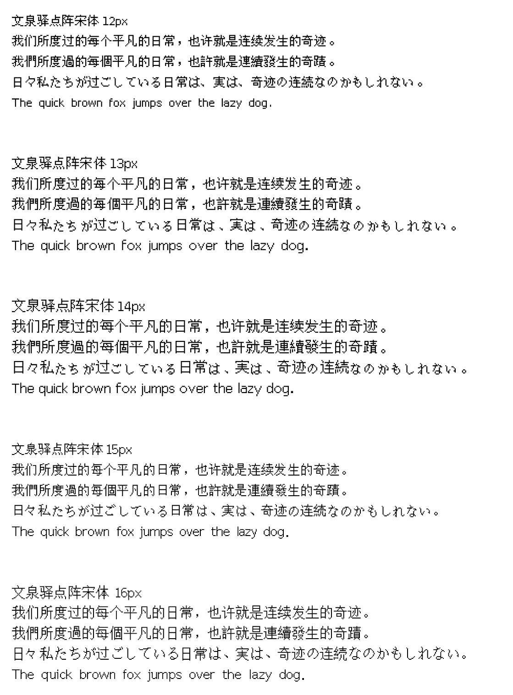

# 文泉驿点阵宋体 TTF 格式

## 简介

> 文泉驿点阵宋体是一个"自由中文字体"。该字体包含了所有常用简体中文、繁体中文，日文及韩文所需要的汉字(最新版本包含超过27842个汉字，完整覆盖GB2312/Big5/GBK/GB18030标准字符集)。该字体同时还包含了英文、日文、韩文和其他多种语言符号。该点阵字体包含五个屏幕常用字号(9pt-12pt)，逾21万汉字点阵，这些点阵都经过参与者和组织者的精心设计和调整，手工优化后的汉字点阵显示清晰锐利，特别易于屏幕阅读使用。

此为娱乐部以[文泉驿点阵宋体](http://wenq.org/wqy2/index.cgi?BitmapSong) v1.0.0-RC1 的 PCF 字体制作的 TTF 版字体。希望可以给中文的点阵字体和像素字体增加一个新的选择。

为了方便使用，转换后的字体名称修改成了点阵的尺寸大小，以下是字体名称对照表：

| 尺寸  |       字体名       |        字体名（英）        |     对应源字体     |                             下载                             |
| :---: | :----------------: | :------------------------: | :----------------: | :----------------------------------------------------------: |
| 12x12 | 文泉驿点阵宋体12px | WenQuanYi Bitmap Song 12px | wenquanyi_9pt.pcf  | [点击下载](https://github.com/AmusementClub/Wenquanyi-Bitmap-Song-TTF/blob/master/WenQuanYi%20Bitmap%20Song%2012px.ttf) |
| 13x13 | 文泉驿点阵宋体13px | WenQuanYi Bitmap Song 13px | wenquanyi_10pt.pcf | [点击下载](https://github.com/AmusementClub/Wenquanyi-Bitmap-Song-TTF/blob/master/WenQuanYi%20Bitmap%20Song%2013px.ttf) |
| 14x14 | 文泉驿点阵宋体14px | WenQuanYi Bitmap Song 14px | wenquanyi_13px.pcf | [点击下载](https://github.com/AmusementClub/Wenquanyi-Bitmap-Song-TTF/blob/master/WenQuanYi%20Bitmap%20Song%2014px.ttf) |
| 15x15 | 文泉驿点阵宋体15px | WenQuanYi Bitmap Song 15px | wenquanyi_11pt.pcf | [点击下载](https://github.com/AmusementClub/Wenquanyi-Bitmap-Song-TTF/blob/master/WenQuanYi%20Bitmap%20Song%2015px.ttf) |
| 16x16 | 文泉驿点阵宋体16px | WenQuanYi Bitmap Song 16px | wenquanyi_12pt.pcf | [点击下载](https://github.com/AmusementClub/Wenquanyi-Bitmap-Song-TTF/blob/master/WenQuanYi%20Bitmap%20Song%2016px.ttf) |

## 字体预览



## 转换步骤

以 wenquanyi_9pt.pcf 为例

1. 下载 Original Fonts 中的 pcf 文件，或是直接到文泉驿官网下载[压缩包](http://wenq.org/wqy2/index.cgi?Download#BitmapSong_Beta)

2. 下载或  Clone [pcf2bdf](https://github.com/ganaware/pcf2bdf/releases) 源代码，并编译（依赖：gcc）

   ```shell
   make -f Makefile.gcc install
   ```

3. 利用 pcf2bd 将 pcf 文件转换成 bdf 文件：

   ```shell
   pcf2bdf -o wenquanyi_12px.bdf wenquanyi_9pt.pcf
   ```

4. 安装 [java](https://www.java.com/en/download/) ，访问 [Bits’N’Picas](https://github.com/kreativekorp/bitsnpicas/releases) 下载 BitsNPicas.jar，然后使用它将 bdf 字体转换成 ttf。

   ```shell
   java -jar BitsNPicas.jar convertbitmap -f ttf -o wenquanyi_12px.ttf wenquanyi_12px.bdf
   ```

5. 安装 [python3](https://www.python.org/downloads/) (3.8 或以上版本) 并使用 pip 安装 [fonttools](https://github.com/fonttools/fonttools)

   ```shell
   pip install fonttools
   ```

6. 使用 fonttools 的 ttx 程序将 ttf 字体转换成 ttx 格式：

   ``` shell
   ttx wenquanyi_12px.ttf
   ```

7. 使用 [VS Code](https://code.visualstudio.com/) 或其他能处理大尺寸文本文件的编辑器打开 `wenquanyi_12px.ttx`，按 Ctrl + F 搜索 `namerecord`，参考微软对字体 name table 的解释，将字体名字等信息修改为你想要的内容并保存。

8. 将修改后的 ttx 文件转换回 ttf。

   ``` shell
   ttx -o "WenQuanYi Bitmap Song 12px" wenquanyi_12px.ttx 
   ```

9. 正常使用你转换好的 ttf 文件。


该流程也适用于其他 pcf 字体文件。

参考： https://hackmd.io/@OrangeBurrito/pcf-font-to-tff#


## 使用工具

- [fonttools](https://github.com/fonttools/fonttools)

- [pcf2bdf](https://github.com/ganaware/pcf2bdf/)
- [Bits'N'Picas](https://github.com/kreativekorp/bitsnpicas)


## 授权许可

本字体版权为“[文泉驿信任委员会(Board of Trustees)](http://wenq.org/wqy2/index.cgi?CopyrightPolicy)”, [FangQ](http://wenq.org/wqy2/index.cgi?FangQ)和[Firefly](http://wenq.org/wqy2/index.cgi?Firefly)所有。字体授权继承文泉驿点阵宋体所采用的 GNU Public License v2 (附加允许文档嵌入条款)，详情请参照文泉驿 [README](https://github.com/AmusementClub/Wenquanyi-Bitmap-Song-TTF/tree/master/Original%20Fonts) 文件。

[字体作者](https://github.com/AmusementClub/Wenquanyi-Bitmap-Song-TTF/blob/master/Original%20Fonts/AUTHORS)
